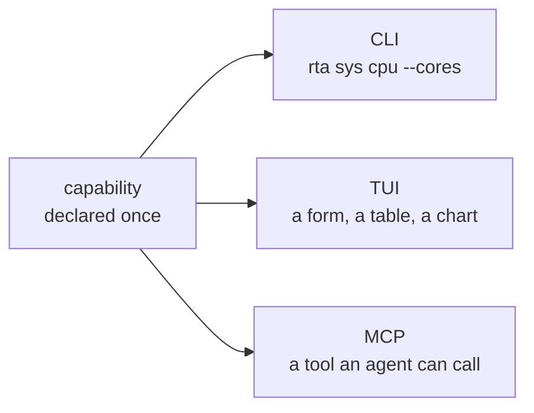

# rta documentation

`rta` is one binary over the tools you already juggle — databases, object storage, secrets, networking, certificates, host telemetry, HTTP APIs. Every capability is written once and rendered on three surfaces: a scriptable CLI, an interactive TUI, and an MCP server for AI agents.

## It works with your agent, not instead of it

rta is not another AI CLI, and it does not want to be the thing you talk to. It is the layer underneath the one you already use — Claude Code, Codex, Cursor, Copilot, Gemini — the part that decides what those agents are actually allowed to touch.

That is the whole proposition. Handing an agent a shell is **one decision that covers everything it will ever do**. Pointing it at rta is a different shape: read-only by default, everything else granted per capability, narrowed to one record, expiring on its own, and written down. You keep your agent; it gets a smaller blast radius and you get a record.

Which is why the security chapters below are not an appendix, and why every one of them is also usable by a person at a terminal. The same capability serves both — nothing here is an agent-only feature bolted on.

## Start here

| Chapter | What it covers |
| --- | --- |
| [Installation](./docs/01-installation.md) | Build it, verify it, put it on `$PATH`, turn on completion |
| [Quick start](./docs/02-quickstart.md) | Ten minutes: the CLI, the TUI, and an agent that can only read |

## Using rta yourself

| Chapter | What it covers |
| --- | --- |
| [The CLI](./docs/10-cli.md) | Output formats, exit codes, `--dry-run`, `explain`, scripting |
| [The TUI](./docs/11-tui.md) | The dashboard, the catalogue, forms and confirmations |
| [Seeing the shape of things](./docs/15-trees.md) | Mapping a directory, a bucket, a Vault mount or an etcd keyspace in one call |
| [Secrets (`kv`)](./docs/30-secrets.md) | An encrypted local store for passwords, certificates and key files |
| [Profiles](./docs/40-profiles.md) | Naming an environment once and pointing every plugin at it |

## Giving an agent access

Read these in order. Each one is a smaller blast radius than the one before it.

| Chapter | What it covers |
| --- | --- |
| [What rta actually bounds](./docs/19-the-boundary.md) | **Read this first.** An agent with a shell is not bounded by rta — what that means, and how to be in the configuration where it is |
| [MCP and the safety gate](./docs/20-mcp.md) | Connecting a client, naming it, and what it can reach before you grant anything |
| [Connecting your AI tool](./docs/24-ai-clients.md) | Claude Code, VS Code, Cursor, Codex, Gemini, Copilot — and anything else that speaks MCP |
| [Grants](./docs/21-grants.md) | Time-boxed permission for one capability, optionally one record |
| [The record](./docs/22-audit-trail.md) | What agents asked for, what they got, and what is waiting on you |
| [Team policy](./docs/23-team-policy.md) | A ceiling a repository can commit, which can only ever subtract — and how to notice when it goes missing |

## Extending rta

| Chapter | What it covers |
| --- | --- |
| [Using plugins](./docs/50-plugins.md) | Discovery, trust, indexes, install and upgrade |
| [Writing a plugin](./docs/writing-a-plugin.md) | The SDK, the conformance suite, `plugin new` and `plugin dev` |

## Going further

| Chapter | What it covers |
| --- | --- |
| [Recipes](./docs/90-recipes.md) | Worked end-to-end examples: incident triage, a scoped agent, CI checks, backups |

## What is in it

**16 built-in plugins, 101 capabilities** in the default build, and `rta plugin list` is the inventory:

`sys` · `net` · `http` · `cert` · `fs` · `kv` · `todo` · `note` · `gen` · `codec` · `audit` · `grant` · `agent` · `debug` · `keys` · `git`

Plus anything you install. Eleven plugins ship in this repository as proof the contract works — `pg`, `mysql`, `mariadb`, `etcd`, `qdrant`, `s3`, `vault`, `kube`, `cnpg`, `docker` and `eol` — each a separate binary, so the ones you skip cost you nothing.

## The shape of the thing

Everything in rta is a **capability** — a small, declared unit of work with typed inputs, a safety class, and one implementation. `sys.cpu` is a capability. So is `kv.get`, `pg.query` and `net.dns`.

A capability declares itself once, and the surfaces are generated from that declaration:

Which means three things worth knowing early:

- **`rta explain <capability>`** prints the same card the TUI and the MCP schema are built from. It is the authoritative reference for any command, and it is never out of date.
- **A safety class travels with the capability**, not with the surface. `read`, `write` and `destructive` mean the same thing whoever is asking — the difference is what each surface does about it.
- **Adding a plugin adds capabilities to all three surfaces at once.** There is no separate MCP registration step, and no way for a plugin to appear on one surface and not another.
