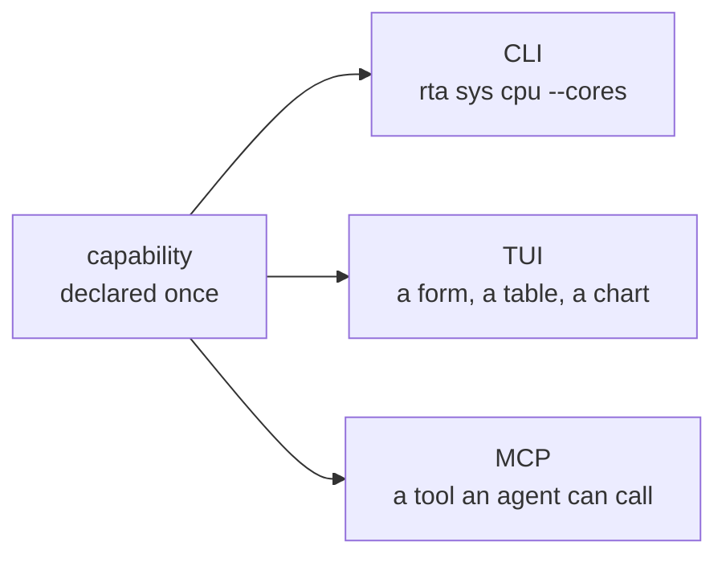

# RTA :ring:

**RTA**, short for *Rule Them All* and written `rta` on the command line, is one binary over the tools you already juggle: databases, object storage, secrets, networking, certificates, host telemetry, HTTP APIs. Every capability is written once and rendered on three surfaces: a scriptable CLI, an interactive TUI, and an MCP server for AI agents.

## It works with your agent, not instead of it

rta is not another AI CLI, and it does not want to be the thing you talk to. It is the layer underneath the one you already use — Claude Code, Codex, Cursor, Copilot, Gemini — the part that decides what those agents are actually allowed to touch.

That is the whole proposition. Handing an agent a shell is **one decision that covers everything it will ever do**. Pointing it at rta is a different shape: read-only by default, everything else granted per capability, narrowed to one record, expiring on its own, and written down. You keep your agent; it gets a smaller blast radius and you get a record.

Which is why the security chapters below are not an appendix, and why every one of them is also usable by a person at a terminal. The same capability serves both — nothing here is an agent-only feature bolted on.

## Platforms

rta runs on macOS and Linux, on both `amd64` and `arm64`. It does not run natively on Windows; a person on Windows can use the Linux build under the Windows Subsystem for Linux, version 2, which has not been tested.

## Documentation

**Website:** <https://this-is-tobi.com/rta/introduction>

**Table of Contents** *- md sources*:

*Getting started*
- [Installation](./docs/10-getting-started/10-installation.md) *- Download it, put it on `$PATH`, check it works, and where the two supported systems differ*
- [Quick start](./docs/10-getting-started/20-quickstart.md) *- Ten minutes: the CLI, the TUI, and an agent you connect, refuse and allow*
- [Connect an agent](./docs/10-getting-started/30-connect-an-agent.md) *- Registering a client, naming it, and checking that it reached rta*
- [Other ways to install](./docs/10-getting-started/40-other-ways-to-install.md) *- From source, the container image, the Helm chart, and the plugins that arrive from an index*

*Using it*
- [The CLI](./docs/20-using/10-cli.md) *- Output formats, exit codes, `--dry-run`, `explain`, scripting*
- [The TUI](./docs/20-using/20-tui.md) *- The dashboard, the catalogue, forms and confirmations*
- [Seeing the shape of things](./docs/20-using/30-trees.md) *- Mapping a directory, a bucket, a Vault mount or an etcd keyspace in one call*
- [Profiles](./docs/20-using/40-profiles.md) *- Naming an environment once and pointing every plugin at it*
- [Secrets (`kv`)](./docs/20-using/50-secrets.md) *- An encrypted local store for passwords, certificates and key files*

*The boundary* — worth reading in this order: each chapter is a smaller blast radius than the one before it
- [What rta actually bounds](./docs/30-boundary/10-the-boundary.md) *- Read this first before giving an agent access: an agent with a shell is not bounded by rta, and this is how to be in the configuration where it is*
- [MCP and the safety gate](./docs/30-boundary/20-mcp.md) *- What a connected agent can reach before you grant anything, and what every call is checked against*
- [Grants](./docs/30-boundary/30-grants.md) *- Time-boxed permission for one capability, optionally one record*
- [The record](./docs/30-boundary/40-audit-trail.md) *- What agents asked for, what they got, and what is waiting on you*
- [Stop an agent now](./docs/30-boundary/45-stop-an-agent-now.md) *- Locks: the instant no, ahead of any expiry or revocation*
- [Team policy](./docs/30-boundary/50-team-policy.md) *- A ceiling a repository can commit, which can only ever subtract*
- [Connecting your AI tool](./docs/30-boundary/60-ai-clients.md) *- Claude Code, VS Code, Cursor, Codex, Gemini, Copilot, and anything else that speaks MCP*
- [Hosting a server](./docs/30-boundary/65-hosting-a-server.md) *- `--http`, tokens, probes, and what a remote server leaves out*
- [The operator channel](./docs/30-boundary/66-operators.md) *- Issuing grants and answering consent on a server you have no shell on*
- [Containers and images](./docs/30-boundary/67-containers-and-images.md) *- The hardened server recipe, sharing an image, and why not one server for everyone*
- [OIDC](./docs/30-boundary/70-oidc.md) *- Naming the person behind a call with the identity provider you already have: what rta verifies, a Keycloak walkthrough, and where the failure messages go*
- [Kubernetes](./docs/30-boundary/80-kubernetes.md) *- Deploying the boundary as a chart, one instance per person: the decisions to make before setting a value, the posture worth choosing, and day two*

*Plugins*
- [Using plugins](./docs/40-plugins/10-plugins.md) *- Discovery, trust, indexes, install and upgrade*
- [Writing a plugin](./docs/40-plugins/20-writing-a-plugin.md) *- The SDK, the conformance suite, `plugin new` and `plugin dev`, and publishing it to an index*

*Recipes*
- [Recipes](./docs/90-recipes/01-readme.md) *- Worked end-to-end examples: incident triage, a scoped agent, CI checks, backups*
- [For a security team](./docs/90-recipes/10-for-security-teams.md) *- Deploying rta, committing a ceiling, handing out roles, reviewing grants and the record, stopping an agent*
- [For a developer](./docs/90-recipes/20-for-developers.md) *- A day's work: environments, secrets, grants for your agent, the TUI*
- [An agent in a cluster](./docs/90-recipes/30-an-agent-in-a-cluster.md) *- From a profile to an agent connected over MCP, with a minted, expiring ServiceAccount token the only thing between them and the cluster*

*Reference*
- [Glossary](./docs/95-reference/10-glossary.md) *- The words these pages use in one particular way — grant, record, roster, profile, role, plugin — and the acronyms they assume*
- [The path gate](./docs/95-reference/20-the-path-gate.md) *- Roots, symbolic links, hard links and `git`: exactly where the line falls*
- [Verify a download](./docs/95-reference/30-verify-a-download.md) *- Checksums, build attestations and signatures for the archive, the image and the chart*
- [External tools](./docs/95-reference/40-external-tools.md) *- The programs some capabilities shell out to, and what is lost without each*
- [Where rta keeps things](./docs/95-reference/50-where-rta-keeps-things.md) *- The config file, the data directory and every file in them*

## What is in it

**20 built-in plugins, 128 capabilities** in the default build, and `rta plugin list` is the inventory:

`sys` · `net` · `http` · `cert` · `fs` · `kv` · `note` · `gen` · `codec` · `time` · `audit` · `grant` · `agent` · `operator` · `lock` · `pkg` · `debug` · `keys` · `git` · `eol`

Plus anything you install. Twelve first-party plugins live in [rta-plugins](https://github.com/this-is-tobi/rta-plugins) as proof the contract works — `pg`, `mysql`, `mariadb`, `etcd`, `qdrant`, `redis`, `s3`, `vault`, `kube`, `cnpg`, `docker` and `keycloak` — each a separate binary from a separate module, so the ones you skip cost you nothing, and `rta plugin index add official` is how they arrive.

## The shape of the thing

Everything in rta is a **capability** — a small, declared unit of work with typed inputs, a safety class, and one implementation. `sys.cpu` is a capability. So is `kv.get`, `pg.query` and `net.dns`.

A capability declares itself once, and the surfaces are generated from that declaration:

```mermaid
flowchart LR
    C["capability<br/>declared once"]
    C --> CLI["CLI<br/>rta sys cpu --cores"]
    C --> TUI["TUI<br/>a form, a table, a chart"]
    C --> MCP["MCP<br/>a tool an agent can call"]
```

Which means three things worth knowing early:

- **`rta explain <capability>`** prints the same card the TUI and the MCP schema are built from. It is the authoritative reference for any command, and it is never out of date.
- **A safety class travels with the capability**, not with the surface. `read`, `write` and `destructive` mean the same thing whoever is asking — the difference is what each surface does about it.
- **Adding a plugin adds capabilities to all three surfaces at once.** There is no separate MCP registration step, and no way for a plugin to appear on one surface and not another.
