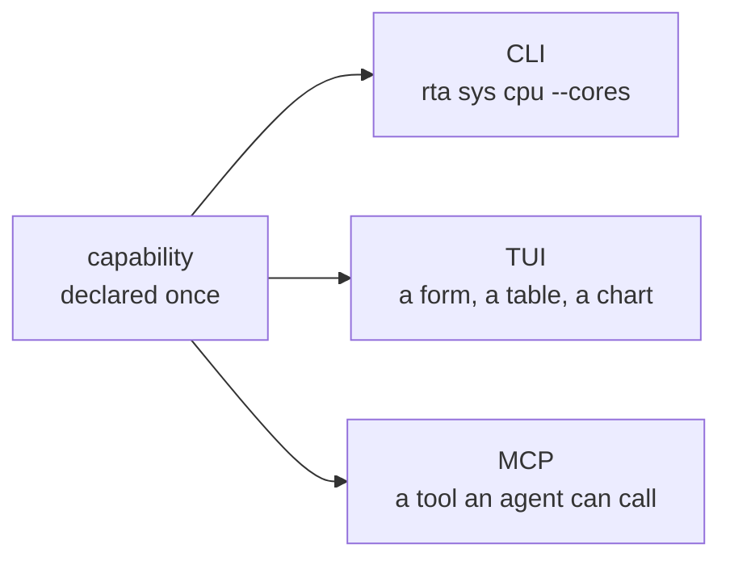

# Start here

**RTA**, short for *Rule Them All* and written `rta` on the command line, is one binary over the tools you already juggle: databases, object storage, secrets, networking, certificates, host telemetry, HTTP APIs. Every capability is written once and rendered on three surfaces: a scriptable CLI, an interactive TUI, and an [MCP](./95-reference/10-glossary.md#acronyms) server for AI agents.

It is also the layer underneath the agent you already use. rta is not another AI CLI and does not want to be the thing you talk to: it is the part that decides what Claude Code, Codex, Cursor, Copilot or Gemini may actually touch. Handing an agent a shell is **one decision that covers everything it will ever do**. Pointing it at rta is a different shape: read-only by default, everything else granted per capability, narrowed to one record, expiring on its own, and written down.

Nothing needs configuring to begin, and nothing needs reading in order. Pick what you came to do. Each track lists its pages in reading order, and every page ends by naming the one that follows it.

## Four tracks

| Track | You want to | Read | Afterwards you can |
| --- | --- | --- | --- |
| **A. Try it** | See what rta does on your own machine | Installation, Quick start: about 15 minutes | Ask your machine anything in five formats, search every capability from the TUI, read any capability's card, and watch an agent be refused and then allowed |
| **B. Give an agent access safely** | Let an agent use rta, and know exactly what it can do | Five pages: about 40 minutes | Have an agent that reads freely, is refused a write, and holds a 15-minute grant you issued, with the record of all three calls and a way to stop it now |
| **C. Run it for a team** | Share a boundary: environments, a ceiling nobody can raise, a server per person | Eight pages: about an hour | Have named environments, secrets in an encrypted store, a committed team ceiling, and a hosted instance each person's agent reaches |
| **D. Extend it** | Add a capability rta does not have | Writing a plugin: 15 minutes, then the rest as you need it | Have a plugin that runs, passes the conformance suite and installs from an index of your own |

### A. Try it

1. [Installation](./10-getting-started/10-installation.md) — one binary, on your `$PATH`, and a check that it works.
2. [Quick start](./10-getting-started/20-quickstart.md) — ask a question, get it in the shape you need, open the shell, read a capability's card, and connect an agent, refuse a call and allow it.

When you want more of the everyday surface, these stand alone and read well in this order: [The CLI](./20-using/10-cli.md), [The TUI](./20-using/20-tui.md), [Seeing the shape of things](./20-using/30-trees.md), [Profiles](./20-using/40-profiles.md) and [Secrets](./20-using/50-secrets.md).

### B. Give an agent access safely

1. [What rta actually bounds](./30-boundary/10-the-boundary.md) — read this first if your agent can run shell commands, which most can. An agent that still has a shell is not bounded by rta at all, and this page says what you get from rta anyway and how to be in the configuration where the rest applies.
2. [Connect an agent](./10-getting-started/30-connect-an-agent.md) — register a client, name it, and check that it reached rta.
3. [Grants](./30-boundary/30-grants.md) — permission for one capability, optionally one record, that expires on its own.
4. [The record](./30-boundary/40-audit-trail.md) — what agents asked for, what they got, and what is waiting on you.
5. [Stop an agent now](./30-boundary/45-stop-an-agent-now.md) — a lock, the instant no.

[MCP and the safety gate](./30-boundary/20-mcp.md) is the reference for what a connected agent can reach and what every call is held to, [Roles, consent and the guard](./30-boundary/35-roles-consent-and-the-guard.md) is what to add once grants are routine, and [Connecting your AI tool](./30-boundary/60-ai-clients.md) has the detail for each client.

### C. Run it for a team

1. [Profiles](./20-using/40-profiles.md) — name an environment once and point every plugin at it.
2. [Secrets](./20-using/50-secrets.md) — an encrypted local store for what a profile refers to.
3. [Team policy](./30-boundary/50-team-policy.md) — a ceiling a repository can commit, which can only ever subtract.
4. [Hosting a server](./30-boundary/65-hosting-a-server.md) — `--http`, tokens, probes, and what a remote server leaves out.
5. [The operator channel](./30-boundary/66-operators.md) — issuing grants and answering consent on a server you have no shell on.
6. [Containers and images](./30-boundary/67-containers-and-images.md) — the hardened server recipe, and why not one server for everyone.
7. [OIDC](./30-boundary/70-oidc.md) — naming the person behind a call with the identity provider you already have.
8. [Kubernetes](./30-boundary/80-kubernetes.md) — the chart: one instance per person, and day two.

### D. Extend it

[Using plugins](./40-plugins/10-plugins.md) first, for how a plugin is found, trusted and confined, and [Indexes and upgrades](./40-plugins/12-indexes-and-upgrades.md) for how one arrives. Then [Writing a plugin](./40-plugins/20-writing-a-plugin.md), which takes fifteen minutes from `plugin new` to a plugin that runs, and four pages for what comes after: [Declaring inputs](./40-plugins/21-declaring-inputs.md), [Answers, errors and hints](./40-plugins/22-answers-errors-and-hints.md), [Safety, credentials and what rta does to your process](./40-plugins/23-safety-and-credentials.md), and [Testing, conventions and publishing](./40-plugins/24-testing-and-publishing.md).

## If you arrive with a job

Start from the work instead of the feature. [For a security team](./90-recipes/10-for-security-teams.md) deploys rta, commits a ceiling, hands out roles and reviews the record. [For a developer](./90-recipes/20-for-developers.md) is a day's work with environments, secrets and a bounded agent. [An agent in a cluster](./90-recipes/30-an-agent-in-a-cluster.md) is the whole path end to end, from a profile to an agent connected over MCP, and [Recipes](./90-recipes/01-readme.md) has the rest, each with its level and what it needs.

A word that seems to mean something particular — a grant, the record, a profile, a role — is defined once in the [glossary](./95-reference/10-glossary.md), with the acronyms these pages assume.

## What you are about to use

Everything in rta is a **capability**: a small, declared unit of work with typed inputs, a [safety class](./95-reference/10-glossary.md#terms) and one implementation. `sys.cpu` is a capability, and so are `kv.get`, `pg.query` and `net.dns`. A capability declares itself once, and the three surfaces are generated from that declaration:

Three things are worth knowing early:

- **`rta explain <capability>`** prints the same card the TUI and the MCP schema are built from. It is the authoritative reference for any command, and it is never out of date.
- **A safety class travels with the capability**, not with the surface. `read`, `write` and `destructive` mean the same thing whoever is asking; the difference is what each surface does about it.
- **Adding a plugin adds capabilities to all three surfaces at once.** There is no separate MCP registration step, and no way for a plugin to appear on one surface and not another.
