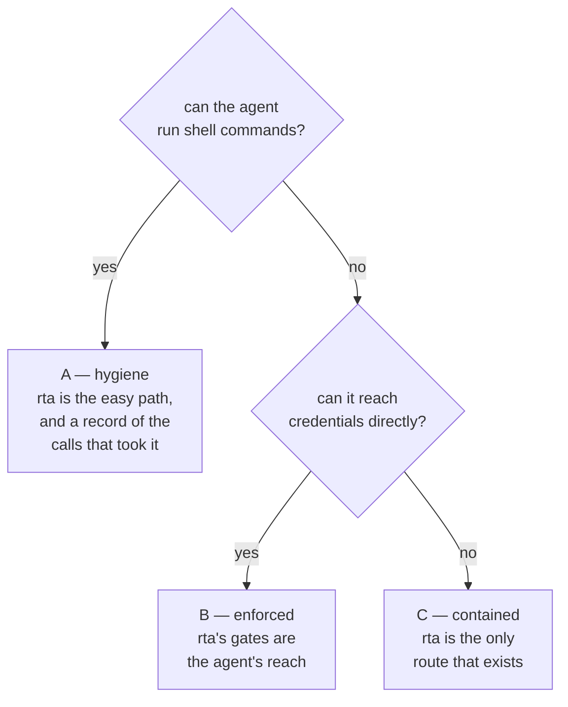

# Quick start

Ten minutes, three surfaces. Nothing here needs configuration, and nothing changes anything outside rta's own data directory until step 5, which registers rta with your AI client. Steps 1 to 4 need only a terminal; step 5 needs an MCP client such as Claude Code, Cursor or Codex.

## 1. Ask it something

```bash
rta sys cpu
```

```
model  Apple M3 Max
cores  14 physical, 14 logical
usage  62.5%
```

Every capability works the same way — `rta explain` lists all of them:

```bash
rta sys overview            # grouped host health
rta net dns github.com      # DNS, with --type auto
rta cert expiry example.com # when its TLS certificate runs out
rta fs usage ~/Downloads    # what is using space
rta git status              # a repository's state, structured
rta audit web example.com   # TLS, headers, cookies, exposure — graded
```

## 2. Get it in the shape you need

The same command renders five ways. `--output` (or `-o`) is on every command:

```bash
rta sys cpu -o json | jq '.pairs'
rta net dns github.com -o csv
rta sys overview -o md >> report.md
```

`pretty` is the default when a human is looking. Scripts should say what they want, and what they get back has a shape that depends on the answer: `sys cpu` is key/value pairs, so `jq` reads `.pairs`, and `net dns` is a table, whose rows are `.rows`. [The shape of a result](../20-using/10-cli.md#the-shape-of-a-result) lists them.

## 3. Open the shell

```bash
rta
```

Bare `rta` on a terminal opens the interactive TUI — a live dashboard with a search bar over every capability, one tile per plugin, and forms for anything that takes input. In a pipe it prints help instead, so a script never hangs on an invisible TUI.

Type to search, `enter` to run, `esc` to go back, `ctrl+c` to quit.

## 4. Find out what anything does

```bash
rta explain sys.cpu
```

```
id           sys.cpu
summary      Show CPU model, core count and current usage
safety       read
cli          rta sys cpu [--cores <bool>]
```

Those are the rows to read first: what it is, what it does, whether it can change anything (`read` cannot), and the command line. The full card has a few more around them, such as whether the call is idempotent, the MCP tool name, the config keys the capability reads and what the dashboard does with it. They mean more once you use those parts, and `rta explain sys.cpu` prints them all.

That card is not documentation *about* the capability — it is generated from the same declaration the CLI, the TUI and the MCP schema are built from, so it cannot drift. `rta explain` with no argument lists everything.

## 5. Connect an agent

This is the part worth slowing down for. It needs an MCP client — Claude Code, Cursor, Codex, anything that speaks MCP — and the steps below use Claude Code.

What rta can bound depends on what else the agent can do, so find out which of three situations you are in before you connect anything:

```bash
rta audit clients
```



The `shell` row is the one to read: `Bash` allowed unrestricted puts you in A. Connecting is still worth doing from there, and [What rta actually bounds](../30-boundary/10-the-boundary.md) says what A gives you and how to reach B.

```bash
rta mcp install claude
```

```
registered  Claude Code
as          claude
ran         /usr/local/bin/claude mcp add rta -- /usr/local/bin/rta mcp serve --as claude
scope       this directory only (/home/you/project) — add --global for every project
next        restart Claude Code in this directory, ask it to call sys_overview, and `rta agent overview` shows it connected
reach       read-only until you say otherwise — `rta grant allow <capability> --agent claude` lets one more thing through, and it expires on its own
```

That registers rta with Claude Code for the directory you ran it in, under the name `claude` (the `scope` line says so, and `--global` registers it for every project). The name matters: grants you issue while talking to one client do not follow every other client on this machine. A client with no command of its own gets the block to add printed instead, and rta writes nothing: `rta mcp install cursor --show`. [Connecting your AI tool](../30-boundary/60-ai-clients.md) has every client.

### Ask, get refused, allow, ask again

Start Claude Code in this directory and ask it two things.

First, *"Call the rta `sys_overview` tool."* It runs. A read that stays on this machine needs no grant.

Second, *"Use the rta `note_add` tool to add a note titled remember the milk."* It is refused, because a write costs a grant, and the refusal carries the exact line to run:

```
a person has to allow this first — ask the operator to run `rta grant allow note.add --agent claude --ttl 15m`
```

Run that line yourself, in your own terminal. An agent cannot issue a grant, and that is the point:

```bash
rta grant allow note.add --agent claude --ttl 15m
```

```
claude may call note.add for 15m (until 01:46:07)
```

Ask for the note again. This time it is added, and the record shows all three calls, the refusal included:

```bash
rta agent log
```

```
╭─────┬──────────┬──────────────┬────────┬──────────┬─────────────────────────┬─────────┬─────────┬────────────┬─────────────────────┬─────────────────────────╮
│ SEQ │ AT       │ CAPABILITY   │ AGENT  │ SESSION  │ ARGUMENTS               │ PROFILE │ OUTCOME │ AUTHORIZED │ CODE                │ WHY                     │
├─────┼──────────┼──────────────┼────────┼──────────┼─────────────────────────┼─────────┼─────────┼────────────┼─────────────────────┼─────────────────────────┤
│ 1   │ 01:31:07 │ sys.overview │ claude │ cce732bf │                         │         │ ran     │ open       │                     │                         │
│ 2   │ 01:31:07 │ note.add     │ claude │ cce732bf │ title="remember the     │         │ refused │ blocked    │ core.grant.required │ no active grant for     │
│     │          │              │        │          │ milk"                   │         │         │            │                     │ note.add                │
│ 3   │ 01:31:07 │ note.add     │ claude │ cce732bf │ title="remember the     │         │ ran     │ grant      │                     │                         │
│     │          │              │        │          │ milk"                   │         │         │            │                     │                         │
╰─────┴──────────┴──────────────┴────────┴──────────┴─────────────────────────┴─────────┴─────────┴────────────┴─────────────────────┴─────────────────────────╯
```

That loop is the whole product: the agent asks, rta refuses what it was never given, you decide in one line, and everything is written down. `rta grant list` shows what is allowed right now, and the grant is gone by itself in fifteen minutes.

### What the agent can reach now

**Reads that stay on this machine, and nothing else.** `sys.cpu`, `git status`, `fs usage` and the other reads that describe this machine run without asking. A read aimed at a destination the agent chooses does not: `net.dns`, `net.ping`, `net.port`, `net.probe`, `net.trace`, `http.get`, `http.head`, `cert.expiry`, `audit.web` and `audit.mail` need a grant as a write does, and the grant can name the one host — `rta grant allow net.dns example.org --agent claude`. `rta explain net.dns` shows `grant required (mcp)` on its card, and so does any capability run against a configured connection. Writes and deletes are listed as tools, so the agent can ask for them, and every one is refused until you allow it. The secret store is no exception: `kv.get` is a write, and there is no store to read until you create one.

That is the default with no configuration, no flags, and no decisions from you.

**This bounds the route through rta, not the agent.** Claude Code can also run shell commands, and an agent that can run `rta` itself can issue itself a grant. [What rta actually bounds](../30-boundary/10-the-boundary.md) is the chapter on where that line falls, and `rta grant guard on` puts a passphrase in front of issuing a grant. Read it before you hand an agent anything you would mind losing.

## 6. Check what you have exposed

```bash
rta doctor
```

Read the `info` rows rather than skipping to the failures. Lines like *"the store unlocks from this environment — an MCP server started here can read secrets, bounded only by grants"* are the ones that tell you what an agent started from this shell inherits.

## Where to go next

| If you want to… | Read |
| --- | --- |
| Know exactly what rta does and does not bound, before you grant more | [What rta actually bounds](../30-boundary/10-the-boundary.md) |
| Grant something narrowly | [Grants](../30-boundary/30-grants.md) |
| Understand what an agent can reach | [MCP and the safety gate](../30-boundary/20-mcp.md) |
| Script rta, or use it in CI | [The CLI](../20-using/10-cli.md) |
| Store credentials | [Secrets](../20-using/50-secrets.md) |
| Point rta at staging vs production | [Profiles](../20-using/40-profiles.md) |
| Add postgres, S3, Vault, Kubernetes | [Using plugins](../40-plugins/10-plugins.md) |
| See it all working together | [Recipes](../90-recipes/01-readme.md) |
| Start from your job rather than a feature | [For a security team](../90-recipes/10-for-security-teams.md) · [For a developer](../90-recipes/20-for-developers.md) |
| See every track laid out | [Start here](../01-readme.md) |

## Next

[Connect an agent](./30-connect-an-agent.md) — the connection from step 5 done on purpose: naming, every client, and what to do when nothing shows up.
