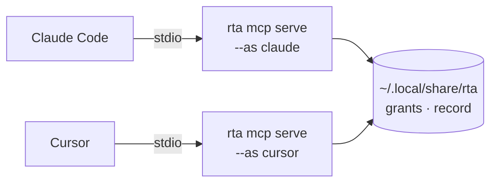

# Connect an agent

[Quick start](./20-quickstart.md) connected Claude Code in one command and took a refused call through to a grant. This page is the same connection done on purpose: how an agent reaches rta, how to register every client you use, why each one gets a name, and how to tell it is working.

If your agent can run shell commands, read [What rta actually bounds](../30-boundary/10-the-boundary.md) first. Everything here assumes the agent goes through the server.

## How an agent reaches rta

An [MCP](../95-reference/10-glossary.md#acronyms) client — Claude Code, VS Code, Cursor, Codex, Gemini, Copilot — launches `rta mcp serve` and gets every capability as a tool, with typed schemas, safety annotations and structured results. Over stdio, the default, there is no daemon, no port and nothing to start: the server is a child process of the client, speaking JSON-RPC over its own stdin and stdout, and it lives exactly as long as the client does. Two clients mean two processes and one set of grants:



Restarting a server changes none of what you allowed, and running one somewhere other than your own machine is the other transport: [Hosting a server](../30-boundary/65-hosting-a-server.md).

## Register a client

```bash
rta mcp install claude
```

Supported clients: `claude`, `vscode`, `codex`, `gemini`, `cursor`, `copilot`. Anything else that speaks MCP works too — [Connecting your AI tool](../30-boundary/60-ai-clients.md) has the per-client detail, including where each keeps its configuration.

Where a client ships its own command for editing its own configuration, rta runs that. Where it does not, rta prints what to add and where, and stops:

```bash
rta mcp install cursor
```

```
client  Cursor
add to  ~/.cursor/mcp.json (or .cursor/mcp.json for one project)
as      cursor
next    add the block to that file yourself — rta writes nothing there. The `--as cursor` in it
        names this agent: grants are issued to that name, so one issued for another client
        does not reach it, and `rta lock add cursor` freezes it
then    restart Cursor, ask it to call sys_overview, and `rta agent overview` shows it connected

{
  "mcpServers": {
    "rta": {
      "command": "/usr/local/bin/rta",
      "args": [
        "mcp",
        "serve",
        "--as",
        "cursor"
      ]
    }
  }
}
```

In `pretty` the block is drawn last, under the pairs, so it can be copied whole. The answer is the same pairs in every format, with the block as one of them — `block`, between `add to` and `as` — so `-o json` hands a script provisioning a machine the block as one value to lift out whole. A client that registered itself answers with `registered`, `as` and the command line it `ran`, then where that put it and what to do next; whatever that client printed of its own goes to stderr, beside the answer rather than inside it.

```
registered  Claude Code
as          claude
ran         claude mcp add rta -- /opt/homebrew/bin/rta mcp serve --as claude
scope       this directory only (/work/shop) — add --global for every project
next        restart Claude Code in this directory, ask it to call sys_overview, and `rta agent
            overview` shows it connected
reach       read-only until you say otherwise — `rta grant allow <capability> --agent claude` lets
            one more thing through, and it expires on its own
```

The `scope` line is there because Claude Code's own default is the directory you ran the command in and nothing else: an agent opened in any other project sees no rta. `--global` registers it for every project. When a client's command is missing or fails, the block is the answer and a `why` pair comes before it saying which: `claude is not on PATH, so rta ran nothing`.

The path registered is the one you ran rta by when it is on `PATH` and is the same file — `/opt/homebrew/bin/rta`, which a package upgrade leaves in place — and the file it resolves to otherwise.

### Server options belong in the registration

The client launches `rta mcp serve`, so a server option is only set if it is in the line the client was given. `rta mcp install` takes the ones that belong there, each off unless you pass it: `--consent`, `--consent-notify` and `--consent-wait` for [live consent](../30-boundary/35-roles-consent-and-the-guard.md#live-consent-when-you-would-rather-be-asked), `--root` (repeatable) for [the path gate](../95-reference/20-the-path-gate.md), and `--max-result` for [the ceiling on an answer](../30-boundary/20-mcp.md#how-large-a-result-may-be).

```bash
rta mcp install claude --consent --consent-notify --root ~/projects
# registers: rta mcp serve --as claude --consent --consent-notify --root /Users/you/projects
```

The options show under `ran`, `--dry-run` and `--show`. A `--root` is registered as the absolute path it names and has to exist, and naming any replaces the default root, the directory the client starts the server in. `--consent-notify` and `--consent-wait` without `--consent` are refused, since they would configure nothing.

### Running it again

Run again, `rta mcp install` compares what is registered with what you ask for. The same registration answers `already registered` and runs nothing, at exit 0, so a provisioning script can call it on every boot. A different name, path or option is replaced through the client's own `mcp remove` and `mcp add`, and `changed` says what differed. That comparison reads the client's configuration and never writes it: for Claude Code it replaces, and `--global` also takes out a directory-only registration of rta for the current directory, which would otherwise override the new one there. An entry that sets environment variables of yours — `XDG_DATA_HOME` is the usual one — is neither replaced nor taken out, since a re-registration would not bring them back: the replacement is refused, naming the variables and never their values, and `--global` leaves that entry where it is and says so, with the line that removes it. Every other client is asked to add, and told there is nothing to do only when its file already holds exactly this registration. When a client refuses because rta is already there and rta cannot read enough to compare, the exit is non-zero and the error carries the exact `claude mcp remove rta --scope user` line to run first. A server of your own that happens to be called `rta`, and does not start rta's server, is never taken out to make room: it is the same refusal, with the same line.

### A client rta does not list

Anything that speaks MCP over stdio takes the standard `mcpServers` block: `rta mcp install windsurf` prints it with `--as windsurf` and says that rta does not know where Windsurf keeps its configuration. A name close to one of the six is read as a typo and refused with the one it was near.

rta never writes another tool's config file, and [Connecting your AI tool](../30-boundary/60-ai-clients.md#why-rta-does-not-write-client-config-files) says why.

## Name it

```bash
rta mcp install claude --as work-laptop
```

**Every server is named.** `rta mcp serve` refuses to start without `--as`, and `rta mcp install` always passes it — the default is the client's name. Without one, every MCP client on your machine would be a single principal sharing one grant file, and worse, one nothing could stop: [a lock](../30-boundary/45-stop-an-agent-now.md) freezes an agent *by name*, so an unnamed server had no handle to pull during an incident.

The name is what a grant is issued to, so naming two clients apart keeps their permissions apart:

```bash
rta mcp install claude --as claude-work
rta mcp install cursor --as cursor-scratch
rta grant allow pg.query --agent claude-work --profile staging --ttl 1h
```

`cursor-scratch` still cannot run `pg.query`, whatever it asks for. Without the names, that one grant would have covered both. `rta grant allow` fills `--agent` in when this machine knows exactly one agent — one that has connected, or that holds a grant already — and asks you which when it knows several. Before any has, name it: `--agent claude`.

The name is your word, not the agent's. A client announces itself in the protocol handshake, and rta records that claim, but it does not authorize on it — *a name a thing chooses for itself is not an identity*. What authorizes is the name you typed when you wired the client up, and the record shows both: the agent name plainly, the client's self-report in parentheses.

## What it can reach on day one

With no grant, an agent can run the reads that stay on this machine and nothing else. Everything that writes or deletes, and every read aimed at a destination the agent names, is refused until you allow it, and the refusal carries the exact command to run. [MCP and the safety gate](../30-boundary/20-mcp.md#what-is-exposed-before-you-decide-anything) is the whole rule, and [Grants](../30-boundary/30-grants.md) is how to allow one thing narrowly.

## Check that it is working

Three things, in order of how much they tell you.

```bash
rta doctor
```

The row worth reading is not about clients at all — it is whether your secret store unlocks without a passphrase in this environment. If it does, an MCP server started here can open it, bounded by grants but able to. `doctor` also reports whether the `claude` CLI is on your `PATH`; the other clients are not probed, because rta only shells out to that one to check.

Then ask the agent to call something harmless. `sys.overview` is a read, needs no grant, and reaches nothing off the machine — it appears to the agent as the tool `sys_overview`, since MCP tool names cannot carry a dot. If it comes back, the wiring is good.

Then look at what actually happened:

```bash
rta agent log --limit 20
```

Every call is there with the name you registered the client under. If the agent name is not what you expect, the client is running an rta you did not configure — an old absolute path, or a second install.

### Nothing shows up

`rta agent overview` has a `connected now` row, and it is the one to read first: it names every client that has an rta server open right now, by the name it was registered under, with how many calls each has made. `--detail` adds a table with what the client called itself, since when, whether a call that needs a grant nobody issued is parked for you (`asks`) or refused (`refuses`), the roots its path arguments are confined to, its session id, the directory it started in and the record file it writes to. From there the silence is one of three things:

- **Connected, zero calls.** The wiring is fine and the agent has not chosen an rta tool yet. Clients with many servers attached pick by tool description, and one that already has a Kubernetes or database server will often reach for that one first. Ask for something only rta answers — `rta agent overview` itself, or a capability under a profile — and the calls appear.
- **Not connected.** Claude Code's `claude mcp add` registers rta for the current directory by default, so a session opened in another directory has no rta server at all. `rta doctor` says which it is — `every project`, `this project`, or `this directory only` — and prints the `--scope user` command that makes it global.
- **Connected, calls made, and the record is empty.** The server and the TUI are reading different data directories. The server prints `record: <path>` when it starts, in the client's MCP log; `rta agent overview --detail` shows the file the TUI reads. A `RTA_DATA_DIR` or `XDG_DATA_HOME` set in one shell profile and not the other is the usual cause.

Several sessions under the same name are one principal — grants and the team ceiling apply to `claude`, not to a window — and the record tells them apart by session: each server has an id, shown on the detail page and as a column in `rta agent log`, and `rta agent log --session <id>` narrows to one.

## Next

[Grants](../30-boundary/30-grants.md) — permission for one capability, optionally one record, that expires on its own.
