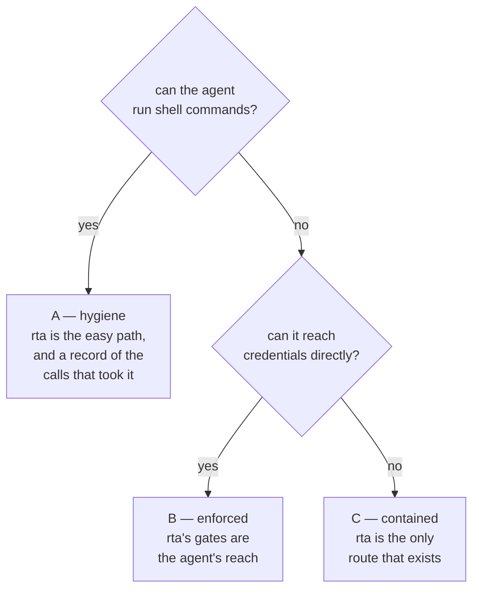

# What rta actually bounds

Read this before the three chapters after it, because it decides what they are worth.

## The short answer

**An agent that can run shell commands is not bounded by rta.** It can run the `rta` binary itself, issue itself a grant, and then use it — and nothing in the record will say so.

That is not a bug and rta cannot fix it. rta is software running as you; so is the agent. Any tool that claimed otherwise would be claiming to contain a process with the same privileges as itself.

One clause of that sentence has an opt-in answer: with [the grant guard](./21-grants.md#the-guard-a-passphrase-in-front-of-issuance) on, issuing a grant requires a passphrase that lives in your head rather than on disk, so "issue itself a grant" stops working — refused, not recorded. The rest of the sentence stands exactly as written: an agent with your shell can walk past rta to the credentials themselves, and no signature changes that.

What rta can do is be exact about where the line falls, so nobody trusts it further than it goes.

## What was measured

Not argued — run, on a scratch data directory, with the guard off, which is the default:

```bash
rta grant allow kv.get --ttl 1h --agent claude
# agents may call kv.get, as agent claude for 1h0m0s

rta agent log
# (empty)
```

The grant is issued. The record says nothing — neither that the grant was issued, nor by what. A `kv_get` call over MCP then passes the grant gate and reaches the handler.

Two more facts from the same run, both by design and both worth knowing:

- **Capability calls made through the CLI are not recorded at all.** The ledger is the record of what arrived *over MCP*. `rta kv get db-password` in a terminal writes nothing, which is right for a person and is also the path an agent with a shell would take.
- **`rta grant allow` is refused over MCP and allowed from a shell.** The refusal is real and it is the right rule; a shell is a human surface, and rta cannot tell an operator's shell from an agent's.

## So what does MCP buy?

Three things, all of them real, and all of them conditional on the agent going through it.

| What MCP buys | Why |
| --- | --- |
| **A narrower interface** | With no flags, an MCP client sees read capabilities and nothing else. The same agent at a shell has everything you have. The tool list *is* the smaller surface |
| **A record** | Every call over MCP is written to a chained, sealed ledger — arguments, outcome, and how it was authorized. Nothing else in rta writes to it |
| **Consent** | Grants, scopes, deadlines, budgets, rates, `rta use`, live consent and dry-run previews are all enforced in the MCP bridge. They exist nowhere else |

Read that list again as a sentence about *cooperative* agents and it is exactly right: rta makes the safe path the easy path. The typed tool with a schema is easier for a model to call correctly than a shell command, it needs no credential handling, and it leaves a record.

Read it as a sentence about a *hostile or prompt-injected* agent with a shell and it is worth nothing. Both readings are true at once, and which one applies to you is a property of your agent's configuration, not of rta.

## Three worlds, and you are in one of them



**World A — an unrestricted shell.** rta is hygiene and visibility. It reduces mistakes, gives you a record of what came through the front door, and takes credentials out of the agent's context. It does not contain anything. Most people setting up an agent for the first time are here and do not know it.

**World B — restricted tools.** The agent's tool list is the MCP server plus whatever else you allowed, and `Bash` is not on it. Now every gate in the next three chapters is load-bearing: a grant is the reach, a deadline is the deadline, and the ledger is complete. **This is achievable today** — it is a setting in your agent, not a feature request in rta.

**World C — somewhere else entirely.** The agent runs in a container or on another machine, with no credentials of its own, and reaches your environments only through rta. Containment by construction, because there is no other route to take.

`rta audit agents` tells you which one you are in:

```
shell       fail   `Bash` is allowed unrestricted in ~/.claude/settings.json — the agent can
                   run any command, which includes every tool that reaches the things rta gates
rta itself  info   an agent that can run commands can run rta itself: issue a grant, then call
                   capabilities the MCP record never sees
```

## "Should agents just be denied the CLI?"

You cannot deny it, and chasing that is the wrong shape. rta is a binary on a machine the agent has a shell on; refusing to run when it thinks an agent launched it would be a check the agent can defeat by copying the file, and a check that can be defeated is worse than none because it reads as protection.

What actually moves you from World A to World B is upstream of rta:

- **Take `Bash` off the allowlist**, or scope it (`Bash(git status:*)` is a decision; `Bash` is the absence of one).
- **Never `bypassPermissions`.** It is every gate below it turned off at once, and `audit agents` grades it as a failure for that reason.
- **Give the agent no credentials of its own.** rta's strongest posture is a secret store the MCP server cannot open — then `kv get` fails whatever grants exist.

`rta audit agents --fix` prints those edits rather than describing them: the scoped allowlist shape, a `chmod` for a config other accounts can read, a pinned version for a server fetched at launch — and a deny list for rta's own authority-expanding commands (`rta grant`, `rta agent`, `rta kv`, `rta plugin trust`), so the ordinary reach for self-granting is refused by the agent's own harness before rta ever sees it. It prints and never writes, for the reason the audit itself states: the file that grants an agent access to your secrets changes by your hand. And a string match is a seatbelt, not a wall — none of rta's own gates relax because it exists.

That is the honest hierarchy: your agent's permission settings are the outer boundary, and rta is what shapes reach *inside* it.

## What this means for a team

The question people arrive with is "can we run one MCP server for everyone" — [answered in the MCP chapter](./20-mcp.md#why-not-one-server-for-everyone), and the answer is no, because a shared process holds the union of every environment's credentials and its record can no longer say who.

But the *instinct* behind it is right, and it is World C. If team members' agents run somewhere that has no credentials and no rta binary of its own, then rta really is the only route, and everything in the next three chapters becomes enforceable rather than advisory.

The way to get there today is [one instance per person from a shared image](./20-mcp.md#a-team-share-the-configuration-not-the-process): the profiles are baked in, the credentials are `kube:` references resolved with each person's own RBAC, and the agent's container holds nothing.

**A remote server, one per person, is stronger still, and [`rta mcp serve --http`](./20-mcp.md#remote-hosting-http) is that shape.** Grants live on the server's disk; an agent with a shell on its own machine can run `rta grant allow` all it likes and be writing to a file the server never reads. There is no shell on the server, so the only way in is the protocol, and `grant allow` refuses over MCP. That closes the seam this whole chapter is about — and it closes the other one too, because with no local CLI there is no unrecorded path: every call is an MCP call, and every MCP call is in the ledger.

It is not free, and the costs are worth naming rather than glossing over:

| Cost | Where it stands |
| --- | --- |
| **Paths change meaning** | `fs tree`, `git status` and `--root` would describe the *server's* filesystem, not the one an agent thinks it is working in — so instead of answering wrong, the whole `fs`/`git`/`sys` families (and the parts of `net` that read or change this host's own configuration) are simply absent from a remote instance's tool list. The functionality is still gone; what changed is that gone is honest instead of silently misleading |
| **Consent needs somewhere to go** | Still true, and still unsolved: `--consent` refuses to even start combined with `--http`, rather than parking a call for a person who is not there to answer it |
| **The credentials move** | Off the laptops, which is better, and onto one process with reach, which is a target. The trade is real in both directions, and authenticating callers over `--http` does not change it — see the next row |
| **It only bounds anything if it is the only route** | If the agent's own machine can reach production directly, routing rta through a server changes nothing. The containment is the network and credential boundary; rta is what makes a *useful* hole in it |

The transport itself turned out to be the easy part, as expected: MCP specifies OAuth 2.1 for HTTP, and [Remote hosting](./20-mcp.md#remote-hosting-http) is that, built on the bearer-token verification the SDK rta links already ships.

## What rta does not do yet, and would be right to

Stated here rather than left implied, because the gap is the interesting part of the picture:

- **The CLI writes nothing to the record.** That is right for an operator and it is also the seam an agent with a shell walks through. Recording every CLI call would drown the agent record in your own work, so what is recorded instead is the one event that matters — see below.

Detection rather than prevention, which is what the ledger's hash chain already is, and for the same reason: against something running as you, visible is the most that is honest — with one measured exception. A secret that is not on disk is different in kind from a check, which is what the kv store's passphrase already proved, and [the grant guard](./21-grants.md#the-guard-a-passphrase-in-front-of-issuance) applies the same fact to issuance: the ordinary self-grant is prevented outright, and only file tampering remains in the detection regime, where it fails closed and loudly.

## What a grant says about where it came from

A grant records whether anybody was there when it was issued, and `rta grant list` shows it:

```
CAPABILITY  PROFILE  AGENT   RECORD  ORIGIN   EXPIRES IN  BUDGET LEFT
kv.get      —        claude  any     command      59m43s  unlimited
```

| Origin | What it means |
| --- | --- |
| `form` | issued from a TUI form |
| `terminal` | issued at a command line with somebody on the other end of it |
| `command` | issued by something with nobody there: a provisioning script, a CI job — or an agent's shell tool |
| `—` | issued before rta recorded this, which is not the same fact and does not read as one |

**The column appears only when something says `command`.** On a machine where every grant was typed by hand it never shows up, and the day one was not, a column arrives saying which — the same rule the Agent column follows, for a sharper version of its reason. `rta doctor` says the same thing in a sentence, and names revoking everything as the answer if none of those was you.

All three unattended cases are legitimate and only you know which one ran, so this is reported and never refused; a provisioning script that could not issue a grant would be a worse tool.

**It can be defeated.** A shell can allocate a pseudo-terminal and be recorded as `terminal` — the tests for this feature do exactly that, with `script`, to check the other branch. It is worth having anyway: the case it catches is the ordinary one, and the ordinary one is what actually happens.

## Next

- [MCP and the safety gate](./20-mcp.md) — what an agent reaches before you decide anything
- [Grants](./21-grants.md) — per-capability, time-boxed consent
- [The record](./22-audit-trail.md) — what actually happened, and shipping it somewhere
