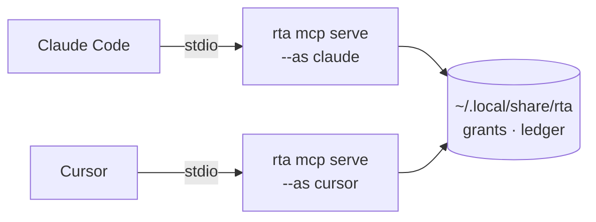

# MCP and the safety gate

rta speaks the Model Context Protocol over stdio. An MCP client — Claude Code, VS Code, Cursor, Codex, Gemini, Copilot — launches `rta mcp serve` and gets every capability as a tool, with typed schemas, safety annotations and structured results.

The interesting part is not that it works. It is what an agent can reach before you have decided anything.

Everything in this chapter assumes the agent goes through the server. An agent that can also run shell commands can run `rta` itself, and [what that does to the guarantees](./19-the-boundary.md) is worth reading first.

## Registering a client

```bash
rta mcp install claude
```

Supported clients: `claude`, `vscode`, `codex`, `gemini`, `cursor`, `copilot`. Anything else that speaks MCP works too — see [Connecting your AI tool](./24-ai-clients.md) for the per-client detail, including where each keeps its configuration and how to check afterwards that it worked.

Where a client ships its own command for editing its own configuration, rta runs that. Where it does not, rta prints what to add and where, and stops:

```bash
rta mcp install cursor
```

```
Add this to ~/.cursor/mcp.json (or .cursor/mcp.json for one project):

{
  "mcpServers": {
    "rta": {
      "command": "/usr/local/bin/rta",
      "args": ["mcp", "serve", "--as", "cursor"]
    }
  }
}
```

### rta does not write another tool's config file

This is deliberate, and there are three reasons in descending order of importance:

- **That file is what grants an agent access to your secrets.** A tool whose entire argument is that consent should be visible and deliberate has no business writing itself into five agents' permission files unattended.
- **Those files hold things rta must not touch.** VS Code's `mcp.json` is JSONC — comments and all — and often carries API keys in headers. A parse-and-rewrite would destroy comments at best and mishandle a credential at worst.
- **A config format changes when its client changes, not when rta does.** The tool that owns the format is the one that stays correct.

`--show` prints the block without running anything, for any client.

## Naming the agent

```bash
rta mcp install claude --as work-laptop
```

Without a name, every MCP client on your machine is **one principal**: consent given while talking to one follows all the others. `--as` is what keeps an agent's grants its own, and `rta mcp install` always passes it — the default is the client's name.

The name is your word, not the agent's. A client announces itself in the protocol handshake, and rta records that claim, but it does not authorize on it — *a name a thing chooses for itself is not an identity*. What authorizes is the name you typed when you wired the client up.

You will see both in the record: the agent name plainly, the client's self-report in parentheses.

## What is exposed, before you decide anything

**Only read capabilities.** That is the default, and it holds with no flags, no config and no decisions.

| Safety class | Exposed over MCP by default | How to open it |
| --- | --- | --- |
| `read` | ✅ yes | — |
| `write` | ❌ no | `--allow-write <plugin>` |
| `destructive` | ❌ no | `--allow-destructive <capability-id>` |

```bash
rta mcp serve --allow-write todo
rta mcp serve --allow-destructive todo.rm
```

Writes open **one namespace at a time** rather than registry-wide. Destructive capabilities are named individually — there is no wildcard, on purpose.

A destructive capability from an external plugin must be pinned to that binary's digest:

```bash
rta mcp serve --allow-destructive hello.wipe@5dae737f8845
```

So the authorisation attaches to an artifact rather than to a name a replacement would inherit.

### The path gate

Every path argument must sit under a **root**. The default root is the directory the server was started in; widen it with `--root`, which is repeatable.

```bash
rta mcp serve --root ~/projects --root /tmp/scratch
```

The gate governs path *arguments* only. A capability that opens a fixed file of its own — `net hosts list` and `/etc/hosts` — is unaffected, because that path is never an argument for anyone to send.

rta says its roots out loud at startup rather than leaving them to be discovered from a refusal:

```
rta mcp server listening on stdio
path arguments confined to: /Users/you/projects, /tmp/scratch
```

### Two gates, different jobs

The `--allow-*` switches are decided **once**, when the server starts, for every call it will ever make. That is the coarse gate, and it is the right shape for "this agent works on todos".

[Grants](./21-grants.md) are the other half: consent for one capability, optionally one record, expiring on its own. That is the fine gate, and it is what you reach for when the answer is "this once".

## Live consent

Off by default:

```bash
rta mcp serve --consent --consent-notify
```

With `--consent`, a call that needs a grant nobody issued is **parked** instead of refused. You answer it:

```bash
rta agent pending
rta agent show 3        # everything about it, including what it would do
rta agent allow 3
rta agent deny 3
```

`--consent-preview` (on by default) runs the capability's own `--dry-run` and shows the result on the parked request, which changes the question from *"may this agent call `todo.rm`"* to *"may it remove **this task**"*.

`--consent-wait` bounds how long a call waits before it is refused anyway (default 90s).

**The default is off on purpose.** A call parked in a server nobody is watching is worse than a refusal: the agent hangs, you never see it, and the timeout is the only thing that resolves it. Turn consent on when you are actually at the machine.

## Environment inheritance

An MCP server inherits the environment it was started from. If your secret store unlocks without a passphrase in that environment, the server can open it — bounded by grants, but able to.

```bash
rta doctor
```

```
kv store    info    unlocks from this environment — an MCP server started here
                    can read secrets, bounded only by grants
```

That line is the whole warning. It is not a misconfiguration; it is a fact about how you set the store up, and it is worth knowing before you connect a client.

## The working directory is the client's choice

A server also inherits its working directory, and two things are decided by it: the default path root, and where the walk up for a [team policy](./23-team-policy.md) starts. You did not choose that directory — the client did.

So a committed `.rta-policy.yaml` bounds this agent only if the client happened to start inside that repository. rta says which one it found at startup, beside the roots:

```
rta mcp server listening on stdio
path arguments confined to: /Users/you/projects
rta: team policy: /Users/you/projects/.rta-policy.yaml
```

`none in force` there means the ceiling you committed is not the one applying. `rta policy require` turns that into a server that refuses to start rather than a line somebody has to notice.

## Where the server runs

There is no daemon, no port and nothing to start. `rta mcp serve` is a child process of your MCP client, speaking JSON-RPC over its own stdin and stdout, and it lives exactly as long as the client does. Two clients means two processes:



Two processes, one grant file — which is the whole reason [`--as`](#naming-the-agent) exists. Without a name they are one principal, and consent given while talking to the first covers the second.

### For one session, or for one task

The server is per-session by construction, so the question is really about the permissions, and those have their own clocks rather than the process's:

| Bound to a task by | What it does | Where |
| --- | --- | --- |
| `rta grant allow … --ttl 30m` | Consent that expires on its own, whatever the server does | [Grants](./21-grants.md) |
| `rta grant allow … --max-uses 5` | Consent that runs out by use rather than by clock | [Grants](./21-grants.md) |
| `rta use staging` | While it is on, every *other* environment is refused whatever grants exist | [Profiles](./40-profiles.md) |
| `rta grant revoke --all` | The end of the task, without touching the client | [Grants](./21-grants.md) |

Restarting the server changes none of it. That is deliberate: a deadline that ended when a process did would be a deadline your editor could reset by crashing.

### In a container, for a hardened server

The binary is static and needs nothing at runtime, so it runs in a `scratch` image — no shell, no package manager, no libc for anything to reach. Point the client at `docker` instead of at `rta`:

```json
{
  "mcpServers": {
    "rta": {
      "command": "docker",
      "args": [
        "run", "--rm", "-i",
        "--read-only", "--cap-drop", "ALL", "--security-opt", "no-new-privileges",
        "--network", "none",
        "-v", "rta-home:/rta-home",
        "-v", "${workspaceFolder}:/work:ro",
        "-e", "RTA_CONFIG=/rta-home/config.yaml",
        "-e", "RTA_DATA_DIR=/rta-home",
        "-w", "/work",
        "ghcr.io/you/rta:latest", "mcp", "serve", "--as", "sandboxed", "--root", "/work"
      ]
    }
  }
}
```

What each part is doing, since a hardening flag nobody can explain is a hardening flag somebody deletes:

| Flag | Why |
| --- | --- |
| `-i` | stdio is the transport; without it the client and the server never meet |
| `--read-only`, `--cap-drop ALL`, `--security-opt no-new-privileges` | The server needs none of it, so it gets none of it |
| `--network none` | The strongest setting, and it turns off every capability that reaches the network — `audit web`, `net dns`, `pg` against anything remote. Drop it when you want those |
| `-v rta-home:/rta-home` | Grants and the ledger have to outlive the container, or every restart is a machine with no memory of what you allowed |
| `-e RTA_CONFIG`, `-e RTA_DATA_DIR` | **Not optional.** With no config directory the config path falls back to `./.rta.yaml`, and profiles are ignored from a working-directory file |
| `-w /work` + `--root /work` | The path root defaults to the working directory, which in a container is `/` unless you say otherwise |

**The image is the plugin allowlist.** A plugin is a separate binary, so a plugin that is not in the image is a plugin the agent cannot reach — no trust decision, no digest, no `$PATH` to search. Building the image with two plugins in it is the narrowest reach rta can be given.

The trade is real and worth stating: a containerized server sees the container's filesystem and network, so `fs tree` maps what you mounted and nothing else, and `git status` sees `/work`. That is the point, and it is also the reason this is not the default.

### A team: share the configuration, not the process

The want is real and worth stating plainly: a team has environments — dev and staging for app A, staging and production for app B — everyone has their own agent, and nobody wants to configure the same six profiles on eight laptops. What people reach for is one shared MCP server everyone points at.

**Share the image instead.** A profile is written by a command, so it can be baked in at build time, and every member starts with the environments already there and nothing to configure:

```dockerfile
FROM alpine:3.20 AS setup
COPY rta rta-plugin-pg /usr/local/bin/
ENV RTA_CONFIG=/rta-home/config.yaml RTA_DATA_DIR=/rta-home
RUN mkdir -p /rta-home && \
    rta plugin trust pg --yes && \
    rta profile set app-a-staging --note "app A, staging" --ttl 8h \
      --plugin pg --set database=app-a \
      --kube staging/app-a/svc/postgres:5432 \
      --secret password=kube:postgres-creds/password && \
    rta profile set app-b-prod --note "app B, production" --ttl 1h \
      --plugin pg --set database=app-b \
      --kube prod/app-b/svc/postgres:5432 \
      --secret password=kube:postgres-creds/password

FROM scratch
COPY --from=setup /usr/local/bin/ /usr/local/bin/
COPY --from=setup /rta-home /rta-home
ENV RTA_CONFIG=/rta-home/config.yaml RTA_DATA_DIR=/rta-home PATH=/usr/local/bin
ENTRYPOINT ["/usr/local/bin/rta"]
```

Each member wires their client to `docker run` on that image, exactly as in the recipe above, mounting their own `~/.kube` and their own state volume. What the image carries is a *reference*, never a value:

```yaml
secrets:
  password: kube:postgres-creds/password
```

So the image is safe to publish to your internal registry. The credential is read at call time from the cluster, **with the caller's own kubeconfig and their own RBAC** — the access control your organisation already runs keeps applying, per person, unchanged. The same is true of the `kube:` forward: reaching the database at all requires that member's cluster access.

That is the whole of "without any config", and everything else stays where it belongs. Grants are theirs. The ledger says what *they* did. `rta use` bounds *their* agents. Nothing is shared that a person has to be accountable for.

Add [`.rta-policy.yaml`](./23-team-policy.md) to the repositories they work in and the team also gets a ceiling — committed, travelling with a clone, needing no seal because it can only ever subtract.

### Why not one server for everyone

Because "a shared server that can reach everything anybody is authorised for" is a single process holding the union of every environment's credentials, reachable by every member's agent. Concretely, it costs you five things:

| What breaks | Why |
| --- | --- |
| Per-person access control | The server authenticates as itself. Your cluster RBAC, database roles and cloud IAM stop distinguishing between eight people and start seeing one service account |
| The record | rta logs the agent name a person typed on their own machine. On a shared process every client is a client of the same process — two members' agents both log as `claude`, and nobody can answer who ran `pg dump` |
| Live consent | `--consent` parks a call and waits for the person at the machine. On a shared server, which person? Whose desktop notification rings, and who is accountable for the answer? |
| `rta use` | It exists to *subtract* — switching to staging takes production away from every agent. Shared, one person switching takes it away from everyone, silently |
| Blast radius | One compromised agent on one laptop reaches the union of every environment, because the union is what the server was configured with |

The transport is the smaller problem, and smaller than it first looks: MCP specifies an OAuth 2.1 authorization framework for HTTP, and the SDK rta already links supports both Streamable HTTP and bearer-token verification. So "who is on the other end" has a standard answer. What it does not change is anything in the table above — authenticating five people to one process that holds the union of their environments tells you which of them is calling and leaves every other row exactly as it is.

None of that is an argument against rta running somewhere other than a laptop. Run it in your dev platform, in a Codespace, in a per-user pod — **one instance per person, authenticating as that person**, built from the shared image. That is the same convenience with none of the collapse.

## Next

- [What rta actually bounds](./19-the-boundary.md) — the precondition everything above rests on
- [Connecting your AI tool](./24-ai-clients.md) — the per-client setup detail
- [Grants](./21-grants.md) — per-capability, time-boxed consent
- [The record](./22-audit-trail.md) — what actually happened
- [Team policy](./23-team-policy.md) — a ceiling nobody can raise
