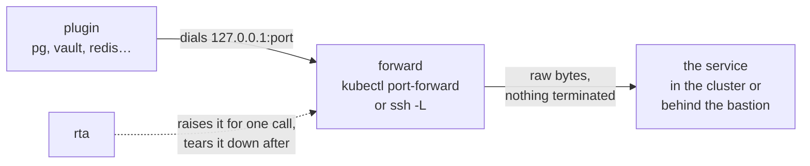

# Reaching private services

Most of what a profile points at is not on your machine: a database in a cluster, a Vault behind a bastion. A connection can say how to get there, and rta raises the path for the one call that needs it.

A forward is a raw byte pipe that rta raises for one call and tears down afterwards. The plugin dials an ordinary local address and never learns a tunnel was there:



## Naming the path

```yaml
profiles:
  staging:
    plugins:
      pg:
        kube: staging/db/svc/postgres:5432
```

A call filled from that connection runs through a `kubectl port-forward` that rta raises and tears down again. The plugin sees an ordinary local address and never learns a tunnel was there — which is why no service plugin needs changing to gain this.

```yaml
profiles:
  staging:
    plugins:
      pg:
        ssh: bastion.example.com/db.internal:5432
```

The same fact, spelled for a service behind a jump host rather than in a cluster. The head is an `~/.ssh/config` alias, and everything your SSH config says about it keeps working — rta shells out to `ssh`.

One forward per call, torn down afterwards. A cached port-forward outlives the pod it points at, and a stale tunnel to a rescheduled pod fails in a way nobody can read.

A forward is also torn down when the server that opened it is killed outright: on Linux the kernel ends it with its parent, and on macOS, which has no such signal, the next `rta mcp serve` finds what a killed one left in `forwards/` under the data directory and stops it — only when the process that started it is gone and the pid still has the start time that was written down, so a pid the kernel has reused is never signalled. Until then a forward left by a `kill -9` is a loopback listener into the cluster; `rta mcp serve` says on its stderr how many it stopped.

A connection states **at most one** of `kube` and `ssh`; both at once is refused.

## When the far side speaks TLS on its own

```yaml
profiles:
  homelab:
    plugins:
      vault:
        kube: homelab/vault-operator-system/svc/vault:8200
        tunnelTLS: true
        set:
          ca-file: ~/.config/rta/vault-ca.crt
          tls-server-name: vault.vault-operator-system.svc
```

`kubectl port-forward` and `ssh -L` are both a raw byte pipe from `127.0.0.1` straight into whatever the destination socket speaks — neither terminates a request the way a proxy would. So the plain `http://` a forward fills in by default is correct for the ordinary case (a plaintext service behind a TLS-secured cluster or bastion hop) and silently wrong for a service whose own listener speaks [TLS](../95-reference/10-glossary.md#acronyms), Vault's being the common example: the forward carries the TLS bytes through unchanged, and a plain HTTP client sending a request into them gets a connection that closes with nothing readable back.

`tunnelTLS: true` says the far end terminates TLS itself, so the forward should be addressed as `https://` — refused if the connection states neither `kube:` nor `ssh:`, since there is then no forward for it to describe. It changes *scheme only*. Certificate verification still runs as normal, against whatever this machine already trusts: a self-signed or cluster-internal [CA](../95-reference/10-glossary.md#acronyms) (an operator-generated root, a private issuer) still refuses, exactly as it would over a direct connection, and `tunnelTLS: true` does not become `--insecure` under any configuration.

The name is checked too, and through a forward the address the plugin dials is `127.0.0.1`, which a server's certificate names only when it was issued to answer probes on loopback as well. A certificate made for the service — `vault.vault-operator-system.svc` above — is refused for its name, and the refusal says the forward is why. `tls-server-name` is the name to check it for instead, the one the service's certificate was issued under: `etcd`, `keycloak`, `qdrant`, `redis`, `s3` and `vault` take it, as a setting only an operator states, and an agent cannot change it. The chain is still checked in full, against the CA the profile names.

**Named apart from any plugin's own `tls` or `sslmode`.** etcd, qdrant and s3 each read `set: {tls: ...}`; pg reads `set: {sslmode: ...}` — that is the plugin's *own* on/off toggle, in its own client library's vocabulary, and the host forces it off over a tunnel (see [Types are part of the declaration](./41-profiles-in-depth.md#types-are-part-of-the-declaration) for that mechanism). `tunnelTLS` is a different fact at a different layer: not a plugin's setting, but what the host must know about the coordinate itself to address it correctly, before any plugin config is even read. The two can sit beside each other in the same entry without conflict — they answer different questions — but they would not if they shared a word.

Where that CA lives is a plugin's own concern rather than the tunnel's, because reading it is a file-read primitive and the plugin declares — or does not — that it trusts a caller-named path for it: a PEM bundle read from this machine, never from the cluster, and never fillable by an [MCP](../95-reference/10-glossary.md#acronyms) caller. `rta explain <capability>` lists whether a given plugin offers one. Not a secret either — a CA certificate is the public half of a key pair, the half a CA hands out for wide distribution so anyone can verify what it signed, the same reason an OS trust store ships thousands of them in the clear. It needs no more protection than `address` does, and reading it through `kv:`/`kube:` the way a credential is would be reaching for the wrong tool.

The field is named for what it mirrors, plugin by plugin, rather than one word forced everywhere:

| Plugin | Field | Why that name |
| --- | --- | --- |
| `etcd`, `vault`, `s3`, `qdrant` | `ca-file` | No existing library vocabulary to mirror, so these four agree with each other instead |
| `pg` | `sslrootcert` | Its own `sslmode` already commits this plugin to libpq's vocabulary, and `sslrootcert` is libpq's own keyword for exactly this — pgx's DSN parser reads it directly |

**`pg`'s `sslrootcert` only matters for a connection reached directly — no `kube:`, no `ssh:`.** A tunnelled one forces `sslmode` to `disable` regardless of what is written under `set:`: `sslmode` carries `plugin.EndpointTLS`, the role a forward's own hop takes over unconditionally (the same mechanism etcd's, qdrant's and s3's own `tls` field go through, and the reasoning is the same one — PostgreSQL's TLS kills a `kubectl port-forward` on the clean disconnect). `disable` never attempts TLS at all, so `pg` leaves `sslrootcert` out of the connection it makes, and a profile that sets it beside `kube:` or `ssh:` is refused, naming the forward — as is `--sslrootcert` given on a call that goes through one (`core.profile.tls.forward`): `sslrootcert` is declared `TLSAdjacent`, a value that does nothing once the TLS mode it depends on is turned off. This is not new with `sslrootcert` — it is the standing rule that governs everything `set:` states about transport security under a coordinate — and it is refused rather than left to do nothing because a CA is the one value here that is easy to type expecting it to survive.

For a directly-reached server — a managed Postgres, an on-prem instance with no forward in front of it — `sslmode` is exactly what `set:` states:

```yaml
profiles:
  managed:
    plugins:
      pg:
        set:
          host: pg.example.internal
          sslmode: verify-ca
          sslrootcert: ~/.config/rta/pg-ca.crt
```

A client certificate and key are `sslcert` and `sslkey`, named the same way. `ssl-home: true` is the opt-in for the habit libpq has of looking under `~/.postgresql` for all three when they are not named: with it on, `pg` uses what is there, resolved once and handed both the driver and `pg_dump`, `psql` and `pg_restore`, so they cannot disagree; it is off by default so that no file is read that a setting did not name, and it is never fillable by an MCP caller.

**`sslmode` does not follow `sslrootcert`, and a CA beside a mode that would not verify against it is refused.** `sslmode`'s own default, `prefer`, never verifies the server in pgx whatever CA it is given, and libpq — which `pg_dump`, `psql` and `pg_restore` run on — verifies under it and then retries in plaintext when verification fails; `require` verifies only because a file is there, and stops without a word the day the file is dropped. So a CA beside either is refused before anything dials, as `pg.tls.ca.unused` and `pg.tls.ca.implied`, naming the mode to set instead: `verify-ca` checks the server's chain against the CA, and `verify-full` its name as well. `verify-ca` with no `sslrootcert` is refused too, since pgx would then check the chain against this machine's own store and read no name, and `sslrootcert: system`, this machine's own store, is taken beside `verify-full` alone. This is deliberate rather than a gap: which axis to move — the CA, how strict to be about it — is two separate decisions, and silently elevating one because the other was set would be a second, undocumented way `sslmode`'s value changes (the codebase already argues against exactly that kind of surprise — see [Types are part of the declaration](./41-profiles-in-depth.md#types-are-part-of-the-declaration)), so the refusal says which mode to set rather than setting it. Set both, as above.

## Related

- [Profiles](./40-profiles.md) — the everyday page
- [Profiles in depth](./41-profiles-in-depth.md) — instances, types, and the other half of the TLS rules
- [Kubernetes](../30-boundary/80-kubernetes.md) — the same idea one level up, for the server an agent reaches

## Next

[Secrets](./50-secrets.md) — what `kv:` references point at.
