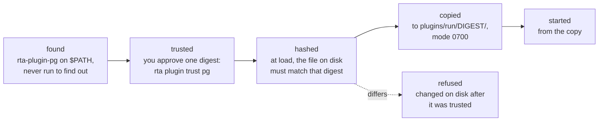

# Using plugins

A plugin is a program that returns a declaration and serves it over [gRPC](../95-reference/10-glossary.md#acronyms). rta launches it and renders what it declares on every surface at once — CLI, TUI and [MCP](../95-reference/10-glossary.md#acronyms). There is no separate registration step, and no way for a plugin to appear on one surface but not another.

```bash
rta plugin list
```

Twelve first-party plugins live in [rta-plugins](https://github.com/this-is-tobi/rta-plugins). They are the proof the contract works, and each is a separate binary you install only if you want it — none of them is linked into `rta` itself, so the ones you skip cost you nothing.

| Plugin | Service |
| --- | --- |
| [`pg`](https://github.com/this-is-tobi/rta-plugins/tree/main/plugins/pg) | PostgreSQL: connection health, schema, rows and activity, and replication — where each standby is and how far behind it is, from the primary or from a standby |
| [`mysql`](https://github.com/this-is-tobi/rta-plugins/tree/main/plugins/mysql) | MySQL: schema, rows, activity and replication status. It reaches a MariaDB server for the capabilities that connect in-process, but not for `dump`/`restore`, which pass MySQL 8's own flags to a client that has them |
| [`mariadb`](https://github.com/this-is-tobi/rta-plugins/tree/main/plugins/mariadb) | MariaDB, whose one replication view carries replica status, the binary log position and Galera cluster state, and a `dump`/`restore` pair spelled the way that client spells it |
| [`etcd`](https://github.com/this-is-tobi/rta-plugins/tree/main/plugins/etcd) | etcd v3: cluster health, members, leases, the keyspace, and a snapshot of the whole backend — the one datastore here whose backup has no restore beside it, because etcd's own API has none |
| [`qdrant`](https://github.com/this-is-tobi/rta-plugins/tree/main/plugins/qdrant) | Qdrant: collections, their configuration and index health |
| [`redis`](https://github.com/this-is-tobi/rta-plugins/tree/main/plugins/redis) | Redis: health, memory, persistence, replication, the keyspace and the slow log — over RESP spoken in-package, no client library |
| [`s3`](https://github.com/this-is-tobi/rta-plugins/tree/main/plugins/s3) | S3-compatible object storage |
| [`vault`](https://github.com/this-is-tobi/rta-plugins/tree/main/plugins/vault) | HashiCorp Vault |
| [`kube`](https://github.com/this-is-tobi/rta-plugins/tree/main/plugins/kube) | Kubernetes |
| [`cnpg`](https://github.com/this-is-tobi/rta-plugins/tree/main/plugins/cnpg) | CloudNativePG: which PostgreSQL clusters exist, what one will tell you about its own health, replication, recovery settings, backups and volumes, and asking for a backup now |
| [`docker`](https://github.com/this-is-tobi/rta-plugins/tree/main/plugins/docker) | containers and images |
| [`keycloak`](https://github.com/this-is-tobi/rta-plugins/tree/main/plugins/keycloak) | Keycloak: users, clients, roles, flows, sessions and events, and a realm graded against named controls — acting as a service account with the `view-*` roles, never an administrator |

Every one of them draws the same line in the same place: the read tier describes the thing, and anything that returns a value somebody stored is a write. `mysql.schema` tells you a database's shape and `mysql.query` returns its rows; `etcd.kv.list` gives you key names and `etcd.kv.get` gives you what a key holds. That is what makes read worth granting.

## Built in, or a plugin

A capability ships built into `rta` when it needs no credential and no configuration, brings nothing outside the standard library, and reaches either nothing or one fixed public host that no input can redirect — `eol.check` asks endoflife.date, the `audit` plugin asks [OSV](../95-reference/10-glossary.md#acronyms) and endoflife.date, and neither can be pointed anywhere else. It is a plugin the moment any of that stops being true: a client library the people who never use it should not carry, a credential location it has to declare, or a destination the caller chooses, which is the line `http.get` sits behind a grant for. Every plugin in rta-plugins fails at least one of those tests, and that is what put it there; `eol` passed all of them, and that is what brought it here.

What is built in, with a first command for each. `rta plugin list` is the same inventory with a count of capabilities and the highest [safety class](../95-reference/10-glossary.md#terms) each carries, and `rta explain <plugin>` lists what is under one.

| Plugin | What it is for | A first command |
| --- | --- | --- |
| `sys` | Host telemetry: CPU, memory, disk, load, processes | `rta sys overview` |
| `net` | Network diagnostics: ping, DNS, ports, hosts file | `rta net dns github.com` |
| `http` | Request any endpoint and inspect the response — a REST client | `rta http get https://example.com` |
| `cert` | X.509 and TLS inspection: certificates, chains, expiry | `rta cert expiry example.com` |
| `fs` | Filesystem answers: what is using space, what is here, what is this file | `rta fs usage ~/Downloads` |
| `git` | Structured views of a git repository — status, log, diff, branches, blame, config, hooks | `rta git status` |
| `audit` | Security hardening checks, each graded against a named OWASP/CWE control | `rta audit web example.com` |
| `kv` | Encrypted local store for secrets, certificates and key files | `rta kv init --generate` |
| `note` | Local notebook: capture, tag, cross-link, schedule, break down, check off | `rta note add "renew the certificate"` |
| `gen` | Generate passwords, tokens and UUIDs — offline, crypto/rand only | `rta gen password` |
| `codec` | Mechanical encode/decode: base64, hex, URL escaping, JWT and JWK inspection | `rta codec b64 hello` |
| `time` | Read an instant in every form worth having: epoch, UTC, local, a named zone | `rta time at` |
| `eol` | Support windows and end-of-life dates, via endoflife.date | `rta eol check go` |
| `pkg` | What is outdated on this machine — every package manager, your own binaries, the OS — and one upgrade at a time | `rta pkg overview` |
| `keys` | Back up an SSH private key as memorizable words, and restore it | `rta keys list` |
| `debug` | Explain terminal escape sequences, and the characters that hide themselves | `rta debug ansi` |
| `grant` | Permissions for AI agents that expire on their own | `rta grant list` |
| `agent` | What AI agents asked rta for, what they got, and what is waiting on you | `rta agent log` |
| `lock` | Freeze one principal now — the instant path when revoking and restarting are too slow | `rta lock list` |
| `operator` | Your identity for managing remote rta servers: a key only your passphrase can use | `rta operator status` |

The last four are rta's own boundary rather than something it inspects, and each has a chapter: [grants](../30-boundary/30-grants.md), [the record](../30-boundary/40-audit-trail.md), [locks](../30-boundary/45-stop-an-agent-now.md) and [the operator channel](../30-boundary/66-operators.md).

## Getting the first-party ones

```bash
rta plugin index add official
rta plugin install pg
```

That is the whole path — [Indexes](./12-indexes-and-upgrades.md#indexes) and [Installing](./12-indexes-and-upgrades.md#installing) are what happens inside it. Building from source instead is `make install` in [rta-plugins](https://github.com/this-is-tobi/rta-plugins), which puts `rta-plugin-<name>` beside your `rta` and approves nothing — which is the next section.

## Trust

**A binary on your `$PATH` is not consent.**

rta discovers anything named `rta-plugin-*` on your `$PATH`, and it loads a plugin by *running* it. So an unapproved binary would execute before anybody typed a command naming it — including during shell completion. That is why discovery and approval are separate:

```bash
rta plugin trust             # what was found and not run
rta plugin trust pg          # approve this artifact
rta plugin untrust pg        # withdraw approval
rta plugin untrust --all     # withdraw every approval you have recorded
```

There is deliberately no `rta plugin trust --all`. Approving is the decision the whole boundary exists to make somebody take one artifact at a time, and a flag that approved everything discovered on a `$PATH` would approve whatever appeared there this morning. The withdrawing direction has no such problem, which is why `--all` exists on that side alone — the same reason `rta plugin allow` has no bulk form either.

**Trust attaches to the artifact's content digest, not its name.** Rebuilding or replacing a plugin needs approving again. That is the feature, not friction: a plugin's bytes changing under a name you already approved is precisely the event worth stopping for.

The path a plugin takes from a file on your `$PATH` to a running process is short, and each step can only refuse:



**What runs is the bytes that were approved, not whatever the name holds a moment later.** A plugin found on `$PATH` is hashed, and then it is copied from the file that was hashed into `plugins/run/<digest>/` in rta's data directory (mode 0700) and started from the copy; a file rewritten in between is refused with `changed on disk after it was trusted` instead of being run under the old approval. A plugin in rta's own store or the system root's is started where it is, because those directories are not ones a confined process can write to. What this does not close is a process of your own user, outside any confinement, writing into rta's data directory: it could equally edit the grants file. Copies that nobody has started in a day are removed the next time one is made.

```bash
rta doctor
```

```
plugin pg      ok   ~/.local/bin/rta-plugin-pg (9 capabilities, 685186a7c11a)
plugin trust   ok   8 artifacts approved to run
```

The same digest is recorded on every grant issued against that plugin:

```bash
rta grant allow hello.wipe --agent claude --ttl 5m     # bound to hello as it is now, not to the name
```

So an authorisation attaches to an artifact rather than to a name a replacement would inherit — replace the binary and the grant stops covering anything. `rta grant list --detail` shows the build each grant is bound to, and marks one whose plugin has since been replaced.

## Confinement

**Confinement is applied on macOS only.** There each plugin runs under `sandbox-exec`, and `rta doctor --detail` reports what it actually applied (plain `rta doctor` keeps the row to one line, with every number below and a pointer to the exception):

```
plugin confinement   ok   sandbox-exec: 2 paths denied read+write (rta's own state),
                          10 denied read (credential locations), 15 directories pinned
                          in place so a rename cannot move either out of its rule;
                          everything else is readable, and so is an installed plugin's
                          own directory under the store — reads only, the one place
                          inside rta's state that is, because a process that cannot
                          read its own directory cannot verify a certificate
```

Read that row rather than assuming it. It states what is denied on *this* machine. On Linux rta applies no sandbox: a plugin runs with your user's full access, the row says `none on linux`, and only the process-group and environment-allowlist rules hold. [Supported platforms](../10-getting-started/10-installation.md#supported-platforms) lists the other places the two systems differ.

The row's last clause is the one exception, and it is there because of what macOS does rather than because a plugin was trusted with something: the Security framework initialises from the main executable's location, so a process that cannot read its own directory cannot verify a [TLS](../95-reference/10-glossary.md#acronyms) certificate at all. Without the carve-out no managed plugin could reach an `https://` address, while a copy of the same plugin on `$PATH` could. It is reads only, of that one directory, and only for an artifact rta installed there, or for the private copy it starts a `$PATH` plugin from.

### When a plugin needs one of those locations

Some plugins exist to use a credential location. `kube` and `cnpg` shell out to `kubectl`, and `kubectl` cannot reach any cluster without `~/.kube/config` — so for them the denial is not caution, it is the plugin being unable to do the one thing it is for.

Such a plugin **declares** what it needs. Declaring is asking, never getting:

```bash
rta plugin allow                  # what each plugin asks for, and what it has
rta plugin allow cnpg             # allow everything it declares
rta plugin allow cnpg kubeconfig  # or just that one
rta plugin disallow cnpg          # take it back
```

This is deliberately a second decision, separate from `rta plugin trust`. Letting an artifact run and letting it read your cluster credentials are different questions, and an answer to the first must not stand in for the second. Both attach to the artifact's digest, so **rebuilding a plugin asks again** — for the credential grant exactly as for trust, and for the same reason.

You can only allow what the artifact asked for. A location a plugin never declared is access nobody requested, so there is no way to hand it over — and a record that names one anyway, written by anything but `rta plugin allow`, opens nothing.

A plugin whose need is not granted still runs. It fails at the call that wanted the file, which is the honest outcome — and `rta doctor` names it as a decision rather than leaving you to read someone else's "operation not permitted":

```
plugin cnpg   warn   ~/.local/bin/rta-plugin-cnpg (5 capabilities, e1a4fcaacd73)
                     — asks to read kubeconfig and has not been allowed to;
                     calls that need it fail. `rta plugin allow cnpg`
```

It names the granted side too, because a standing permission is the thing worth being able to point at:

```
plugin cnpg   ok   ~/.local/bin/rta-plugin-cnpg (5 capabilities, 24757826bbf5)
                   — allowed to read kubeconfig;
                   `rta plugin disallow cnpg` takes it back
```

## What a plugin can and cannot do

| A plugin… | Can it? |
| --- | --- |
| Adds capabilities to all three surfaces | ✅ automatic |
| Declares its own safety classes | ✅ — and rta enforces them |
| Names a secret it wants from your store | ❌ never — [you write that mapping](../20-using/40-profiles.md#secrets-holds-a-reference-never-a-value) |
| Learns which of your profiles a call came through | ✅ its name, and whether rta opened a `kube:` or `ssh:` forward for the call — so a receipt can name `--profile` rather than a forward that has closed — and nothing else: never the coordinate, which values the profile filled, or where its credentials come from |
| Invents an output format | ❌ — one envelope, so `--output` works everywhere |
| Runs before you approve its digest | ❌ |
| Bypasses grants, path roots or the safety gate | ❌ — all enforced host-side |

A plugin's write and destructive capabilities cost a grant, exactly like a built-in's, and that grant is pinned to the plugin's artifact. Nothing about being a plugin buys extra reach.

## Configuring one

Plugin configuration is a declared input, so it is validated the same way a flag is:

```yaml
plugins:
  pg:
    host: db.internal
    database: app
```

Per environment, use [profiles](../20-using/40-profiles.md) instead — the same grammar, one level up, and the thing a grant can name.

## Writing one

```bash
rta plugin new mytool      # scaffolds one that builds, passes its suite, and runs
rta plugin dev             # compile and load it through the identical spawn path
rta plugin dev -- mytool greet world
```

`plugin new` writes a plugin that works as it stands rather than a skeleton with TODOs, so the first run succeeds and every edit after it changes something known-good. `plugin dev` loads it exactly as an installed plugin is loaded — sandbox included — without installing anything.

See [Writing a plugin](./20-writing-a-plugin.md) for the SDK and the `sdktest` conformance suite.

## Related

- [Indexes and upgrades](./12-indexes-and-upgrades.md) — what an index is, searching and installing from one, and upgrading what you installed
- [The plugin inventory](./15-the-plugin-inventory.md) — the same state seen from inside the TUI
- [Profiles](../20-using/40-profiles.md) — configuring a plugin per environment
- [Grants](../30-boundary/30-grants.md) — bounding what an agent reaches through one

## Next

[Writing a plugin](./20-writing-a-plugin.md) — fifteen minutes from `plugin new` to a plugin that runs.
