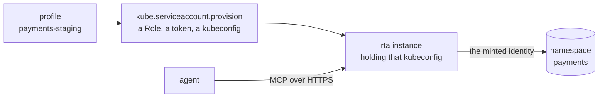

# An agent in a cluster, holding nothing

This is [the third world](../30-boundary/10-the-boundary.md#three-worlds-and-you-are-in-one-of-them) with a Kubernetes cluster in it. The agent reaches the cluster only through an rta instance, and that instance holds only an identity you minted for it: one namespace, a few named reads, and a token the cluster itself stops honouring when its time is up. The agent holds a bearer token for its own instance and nothing else, and every call it makes lands in that instance's record.

It is the narrow answer to [giving an instance access to the cluster it runs in](../30-boundary/80-kubernetes.md#giving-an-instance-access-to-the-cluster-it-runs-in): no ClusterRole, no automounted ServiceAccount token, and a deadline that does not depend on anybody remembering to revoke.



The first two steps run on your own machine, with your own cluster access; the rest put the result somewhere the agent can reach and you can watch.

## 1. Name the cluster once

```bash
rta plugin index add official
rta plugin install kube
rta plugin allow kube
rta profile set payments-staging --note "payments, staging" \
    --plugin kube --set context=staging --set namespace=payments
```

`kube` shells out to `kubectl`, and kubectl needs your kubeconfig — a location rta denies every plugin until you allow it, [a second decision](../40-plugins/10-plugins.md#when-a-plugin-needs-one-of-those-locations) after installing. The profile names the context and the namespace the next steps work in, so none of them repeats `--context` or `--namespace`; `rta profile show payments-staging` says what it covers.

## 2. Mint the identity

```bash
rta kube serviceaccount provision agent-payments --profile payments-staging \
    --grant kube.pod.list --grant kube.event.list --grant kube.deployment.list \
    --ttl 24h --dry-run
```

The dry run creates nothing, and prints the Role it would bind:

```
would create ServiceAccount/Role/RoleBinding agent-payments in namespace payments, mint a token valid for 24h, and return the assembled kubeconfig.

Role rules:
  apps/deployments: get,list
  /events: get,list
  /pods: get,list
```

Then the same line without `--dry-run`, and with a file to write:

```bash
rta kube serviceaccount provision agent-payments --profile payments-staging \
    --grant kube.pod.list --grant kube.event.list --grant kube.deployment.list \
    --ttl 24h --out ~/minted/agent-payments.kubeconfig
```

- **Each `--grant` is a capability the agent will call**, and costs exactly the rules that capability's reads need. The bare words it also takes — `logs`, `workloads`, `services`, `rollout` — are permissions for a client other than rta, and an agent that reaches the cluster only through rta has no capability that would use them. A cluster-wide read such as `kube.node.list` cannot be put in a namespaced Role at all, and is refused rather than half-granted.
- **The file holds no credential of yours**: the cluster's address as your context names it, the cluster's CA, and the new token, at `0600`. `--out` refuses a file that already exists — before anything is created on the cluster — unless `--force` says to replace it.
- **The answer's `actual token expiry` is the one that counts.** A cluster may cap a token below what `--ttl` asked for, silently, and the token is the only place that shows. `--ttl` takes ten minutes at the least, the TokenRequest API's own floor.
- **An agent cannot do this for itself.** Provisioning is for the person at the terminal, and is on no agent's tool list, however the server is started.

## 3. Build the image the agent talks to

The image is [the plugin allowlist](../30-boundary/67-containers-and-images.md#in-a-container-for-a-hardened-server). The published narrow image carries no plugin and no `kubectl`, and the full one carries every plugin, so this one is derived: the full image's own Dockerfile, narrowed to one plugin by a build argument.

```bash
git clone --depth 1 --branch v<version> https://github.com/this-is-tobi/rta.git && cd rta
docker build -f Dockerfile.full --build-arg VERSION=<version> --build-arg RTA_PLUGINS=official:kube \
    -t registry.example.com/platform/rta-kube:<version> .
docker push registry.example.com/platform/rta-kube:<version>
```

`kube` is installed from the official index the way `rta plugin install` installs it — fetched, checked against the index's sha256, trusted by the digest rta computed — into the read-only system root a data volume cannot hide, with `kubectl` beside it. The external tools the full image carries come along, but an agent reaches a tool only through a capability — rta's own, or one a plugin in the image declares — and the only plugin here is `kube`. The image's entrypoint is what reads the chart's `plugins.allow`, below.

## 4. Deploy it, holding the minted kubeconfig

```bash
kubectl create namespace rta
kubectl -n rta create secret generic agent-payments-kubeconfig \
    --from-file=config="$HOME/minted/agent-payments.kubeconfig"
( umask 077
  printf 'laptop %s\n' "$(rta gen token -o json | jq -r '.pairs[] | select(.key == "token") | .value')" \
    > rta-tobi-tokens.txt )
kubectl -n rta create secret generic rta-tobi-tokens --from-file=tokens=rta-tobi-tokens.txt
```

Two Secrets: the minted kubeconfig, and the token file the instance checks every caller against — one `label token` line per caller, and `laptop` is the label its record will name. Then `rta-values.yaml`:

```yaml
image:
  registry: registry.example.com
  repository: platform/rta-kube
  tag: "<version>"                  # a digest is better; see Kubernetes
servers:
  tobi:
    host: rta-tobi.example.com
    roots: ["/work"]
    auth:
      tokens:
        enabled: true
        existingSecret: rta-tobi-tokens
    plugins:
      allow: ["kube"]
    env:
      - name: HOME
        value: /home/rta
    extraVolumes:
      - name: minted-kubeconfig
        secret:
          secretName: agent-payments-kubeconfig
    extraVolumeMounts:
      - name: minted-kubeconfig
        mountPath: /home/rta/.kube
        readOnly: true
    ingress:
      enabled: true
      className: nginx
      tlsSecretName: rta-tobi-tls
```

```bash
helm install rta oci://ghcr.io/this-is-tobi/rta/rta-chart --namespace rta --values rta-values.yaml
```

- **`HOME` and the mount** put the minted file where kubectl looks, `$HOME/.kube/config`: rta hands a plugin no `KUBECONFIG`, for the reason [Kubernetes](../30-boundary/80-kubernetes.md#giving-an-instance-access-to-the-cluster-it-runs-in) gives.
- **`plugins.allow`** is rta's own question about that file — may `kube` read it — answered for this instance.
- **Nothing else in the pod reaches the cluster.** The chart leaves the pod's own ServiceAccount token unmounted and binds it no role, so the minted identity is the only one there.
- **The config holds no profile.** One cluster and one identity make the identity the bound: a `kube` read is an ungated read, and each one lands in the record. A profile there would put every call behind a grant issued on the instance — the heavier shape, for when [the operator channel](../30-boundary/66-operators.md) is set up anyway.
- **The pod has to reach the cluster at the address your context names**, since that is the address in the file. With the chart's NetworkPolicy on, that is one more egress rule.

## 5. Connect the agent

```bash
claude mcp add --transport http rta-payments https://rta-tobi.example.com/ \
    --header 'Authorization: Bearer ${RTA_PAYMENTS_TOKEN}'
```

with `RTA_PAYMENTS_TOKEN` holding the token on the `laptop` line of `rta-tobi-tokens.txt` in the environment Claude Code starts from — your shell profile, or a secret manager that exports it.

Any client that speaks MCP over HTTP takes the same two things: the instance's URL, and the token as a bearer header. Ask the agent which pods in `payments` are not ready: it calls `kube_pod_list`, and the call is in the instance's record under the agent `tobi` and the credential `laptop`:

```bash
kubectl -n rta exec deploy/rta-rta-chart-tobi -- rta agent log --limit 20
```

The agent's tool list carries the `kube` reads and no way to mint an identity, and nothing that describes the machine the instance runs on — a remote transport never registers those.

**The header is the whole credential on this transport**, so the command writes it as a reference: the single quotes keep the shell from expanding it, Claude Code expands it from the environment it starts in, and its configuration, which every process you run can read, names the variable and never holds the token. Pasted in as the token itself, the header is one `rta audit clients` fails, and `--fix` says where it belongs instead — the environment that launches the client, named from the file the way that client reads it, or the client's own credential helper. A static token names whoever holds it; [Kubernetes](../30-boundary/80-kubernetes.md#decisions-to-make-first) weighs it against OIDC for an instance a person uses.

## When the token runs out

The minted token stops working at its expiry, whatever rta does, so the instance loses its reach on schedule rather than keeping it forever. To keep going, mint another — provisioning refuses a name already in use — swap it into the Secret, then revoke the old one:

```bash
rta kube serviceaccount list --profile payments-staging
rta kube serviceaccount provision agent-payments-2 --profile payments-staging \
    --grant kube.pod.list --grant kube.event.list --grant kube.deployment.list \
    --ttl 24h --out ~/minted/agent-payments-2.kubeconfig
kubectl -n rta create secret generic agent-payments-kubeconfig \
    --from-file=config="$HOME/minted/agent-payments-2.kubeconfig" --dry-run=client -o yaml \
  | kubectl apply -f -
rta kube serviceaccount revoke agent-payments --profile payments-staging
```

`list` is an estimate from what provisioning recorded, since Kubernetes keeps no object for a token to ask about. The kubelet refreshes a mounted Secret in place and kubectl reads the file on every call, so the instance needs no restart; revoke once the new file has landed. Revoking deletes the ServiceAccount, which is also the one way to end a token before its time: every token minted against it stops working at once.

That takes the reach away. To stop the agent itself, [lock it](../30-boundary/45-stop-an-agent-now.md) on the instance — `kubectl -n rta exec deploy/rta-rta-chart-tobi -- rta lock add tobi` — and every call it makes is refused from the next one.

## Related

- [Kubernetes](../30-boundary/80-kubernetes.md) — the decisions to make before any value, and day two
- [The kube plugin](https://github.com/this-is-tobi/rta-plugins/tree/main/plugins/kube) — every capability, and the rules each grant name costs
- [For a security team](./10-for-security-teams.md) — the rest of what owning the boundary involves

## Next

[Start here](../01-readme.md) — pick another track.
